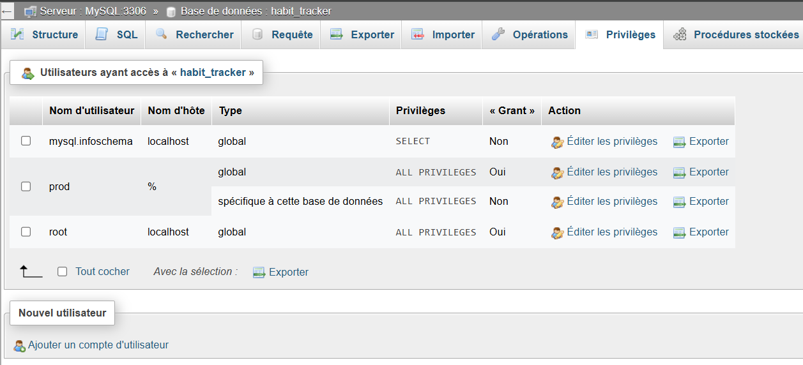
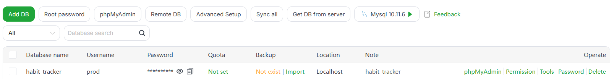
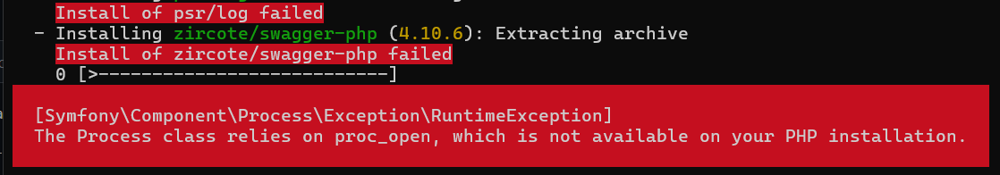
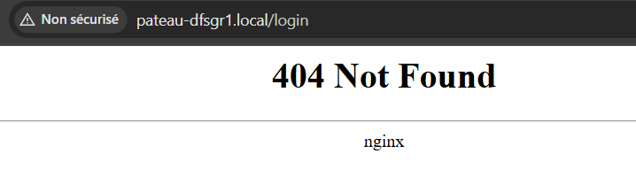

# Procédure de Déploiement

Décrivez ci-dessous votre procédure de déploiement en détaillant chacune des étapes. De la préparation du VPS à la méthodologie de déploiement continu.

## Préparation du VPS

### a. Connexion et installation de aaPanel

1. Connexion SSH :
   `ssh <username>@<IP>`
2. Installation de aaPanel :
   `URL=https://www.aapanel.com/script/install_7.0_en.sh && if [ -f /usr/bin/curl ];then curl -ksSO "$URL" ;else wget --no-check-certificate -O install_7.0_en.sh "$URL";fi;bash install_7.0_en.sh aapanel`

> 💡 Récupérez le script d'installation de aaPanel (gratuit) depuis cette url : [https://www.aapanel.com/new/download.html](https://www.aapanel.com/new/download.html)
>
> ⚠️ Notez les identifiants et liens fournis. L’accès se fait via un navigateur. L’URL est en HTTP, il faudra accepter le risque de sécurité temporairement. Souvent, seule la seconde url est fonctionnelle.
>
> ```bash
> aaPanel Internet Address: https://90.80.241.65:31973/9ce0cd7e
> aaPanel Internal Address: https://172.17.4.20:31973/9ce0cd7e
> username: x56pbwet
> password: 685f62f3
> ```

### b. Configuration du site via aaPanel

1. Dans aaPanel, installer l’environnement **LNMP** (Linux, Nginx, MySQL, PHP). Cela devrait prendre entre dix à vingt minutes.
2. Créer un site depuis le menu website (`Add site`) :
   * Domain name : nom de domaine ou IP publique
   * Créer une base de données (MySQL/MariaDB) : sql_pateau_dfsgr1_local, 94042f09b82288
   * Créer un compte FTP : ftp_pateau_dfsgr1_local , b9b9787e2b00e
   * Choisir la dernière version de PHP
3. Paramétrer le site en cliquant sur le nom du site créé puis `Site directory` :
   * Running directory (Répertoire d’exécution) : `/public` (étape 3.e)
   * Désactiver « Anti-XSS Attack » *(à activer si vous gérez correctement l’échappement côté code)*
   * Activer SSL via Let's Encrypt (menu `SSL`)

### c. Initialisation du dépôt distant (bare)

1. Sur votre vps, installer Git si nécessaire :
   `sudo apt update && sudo apt install git -y`
2. Créer un dépôt bare :

   > 💡Ici, le nom donné à `<nom-dossier-vps>` est deppot_git.
   >

   ```bash
   cd /var
   mkdir <nom-dossier-vps>
   cd <nom-dossier-vps>
   git init --bare
   ```
3. Sur votre machine locale (VSCode, terminal) :

   `git remote add <nom-vps> <username>@<ip>:/var/<nom-dossier-vps>`

## Méthode de déploiement

### a. Déploiement des modifications

1. Commit avec convention git-cliff et génération changelog :

   ```
   git add .
   git commit -m "<mot-clef>: <description>"
   git cliff --bump -o CHANGELOG.md
   git add .
   git commit -m "Version <version>"
   git tag <version>
   ```
2. Push vers le VPS :

   `git push <nom-vps> <version>`

   > 💡`<nom-vps>` est le nom donné au dépôt sur votre vps (cf. 3.c.3)
   > `<version>` est le tag que vous venez d'ajouter
   >
3. Déploiement sur le serveur web (depuis vps) :

   ```bash
   git --work-tree=/www/wwwroot/<ip-ou-domaine> --git-dir=/var/<nom-dossier-vps> checkout -f <version>
   cd /www/wwwroot/<ip-ou-domaine>
   composer install
   ```

   > 💡`<nom-dossier-vps>` cf. 3.c.2
   > `<version>` est le tag que vous venez d'ajouter
   >

### b. Premier déploiement

1. Suivre les étapes du point précédent
2. Définir le dossier `/public` comme "running directory" dans aaPanel.
3. Créer le fichier `.env` dans aaPanel
   1. Option 1 : via aaPanel

      - Aller dans le menu "Files"
      - Sélectionner le nom du site
      - Ajouter un fichier .env à la racine : `File Operations > New > New Blank File`
   2. Option 2 : via SSH

      ```bash
      cd /www/root/<ip-ou-domaine>
      touch .env
      nano .env
      ```
   3. Remplir le fichier (exemple de contenu)

      ```
      APP_ENV=production
      DB_USER=user
      DB_PASSWORD=pwd
      DB_HOST=localhost
      DB_NAME=name
      ```

> 💡 le fichier `.env` contient des informations sensibles, il n'est donc pas versionné dans git (ignoré grâce au .gitignore)
> Pensez à récupérer les informations de la base de données créée dans aaPanel depuis le menu "Databases"

4. Ajouter la base de données
   Il est impossible de se connecter avec root sans mot de passe. La création d'un nouvel utilisateur est donc nécessaire.
   - Rendez vous sur le phpMyAdmin où est sauvegardée votre base de données : [http://localhost/phpmyadmin](http://localhost/phpmyadmin)
   - Sélectionnez votre base de données (ici habit_tracker)
   - Rendez vous dans l'onglet "Privilèges" et cliquez sur "Ajouter un utilisateur"

     
   - Créez un utilisateur en lui donnant tous les droits
   - Rendez vous sur aaPanel puis dans le menu "Databases"
   - Cliquez sur AddDB
   - Renseignez les informations de la base de données avec les identifiants du nouvel utilisateur et confirmez

     
   - Enfin, allez dans le menu "Files", atteignez le fichier `.env` du site et mettez à jour les informations de connexion à la base de données
5. `composer install`

Cette commande vous permet d'installer les packages nécessaires à votre projet. Lancez sur votre vps dans le dossier contenant votre site.

> ⚠️ Il est possible que aaPanel bloque la commande `composer install`. Si c'est le cas, allez sur aaPanel puis Il faut enlevez putenv du fichier de configuration du php du site : App Store > ligne PHP > Setting > Configuration file > l.333 (disable_functions -> retirer putenv)

Vous pourriez aussi rencontrer cette erreur :



Il existe 2 solutions :

* téléverser les bibliothèques (redondant est long)
* comme pour `putenv` retirez `proc_open` du fichier de configuration PHP

### c. Fichier de déploiement automatisé

```bash
cd /var/<nom-dossier-vps>
touch deploy.sh
nano deploy.sh
```

Dans le fichier écrivez :

```bash
git --work-tree=/www/wwwroot/<ip-ou-domaine> --git-dir=/var/depot_git checkout -f $1
cd /www/wwwroot/<ip-ou-domaine>
composer install
```

Pour l'exécuter, 2 solutions :

* `bash <nom script> <version>`
* le passer en éxécutable et l'exécuter :
  * `chmod +x /var/depot_git/deploy.sh`
  * `/var/depot_git/deploy.sh <version>`

> 💡 `<version>` est le tag (cf. Méthode de déploiement - Déploiement des modifications)

### Gestion des routes

Les routes ne sont pas accessibles en dehors de l'accueil :



Il faut activer la redirection sur le site. Pour cela, rendez-vous sur aaPanel puis dans "Website". Cliquez sur votre nom de domaine allez dans le sous menu "URL rewrite" et ajouter

```
location / {
    try_files $uri $uri/ /index.php$is_args$args;
}
```

puis sauvegardez le fichier
