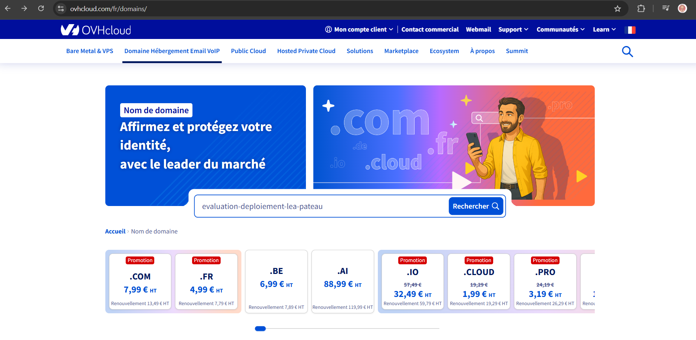
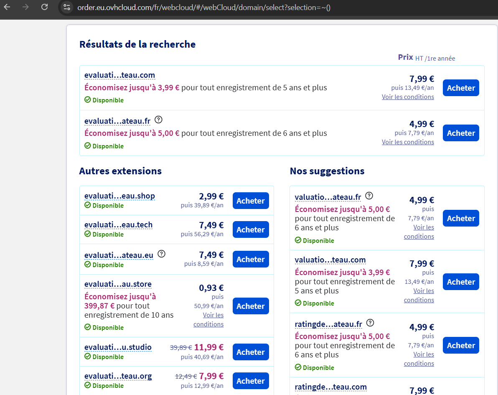
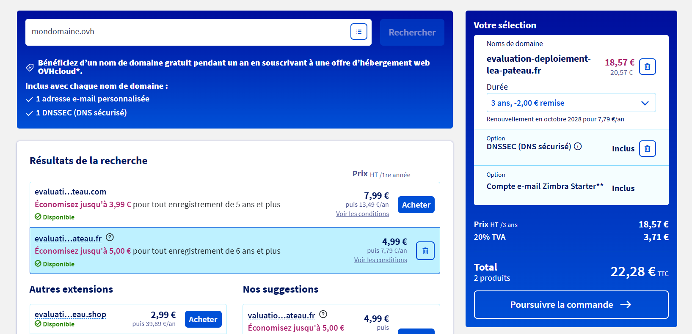

# Questions

Répondez ici aux questions théoriques en détaillant un maxium vos réponses :

1) Expliquer la procédure pour réserver un nom de domaine chez OVH avec des captures d'écran (arrêtez-vous au paiement) :

   - Se rendre sur [https://www.ovhcloud.com/fr/domains/](https://www.ovhcloud.com/fr/domains/)
   - Entrer le nom de domaine voulu dans la barre de recherche "Trouver votre nom de domaine" afin de vérifier qu'il n'est pas déjà pris et connaître les extensions possibles à acheter

     

     
   - Sélectionner le(s) nom(s) de domaine que vous souhaitez acheter en appuyant sur le bouton "Acheter"

     
   - Appuyer sur "Poursuivre la commande"
   - Ajoutez des options si nécessaire
   - Connecctez-vous et finalisez la commande

2. Comment faire pour qu'un nom de domaine pointe vers une adresse IP spécifique ?

   La liaison entre le nom de domaine et une adresse IP spécifiques se fait aisément au travers de l'interface d'hébergement du domaine (comme OVH). [https://alexhost.com/fr/faq/comment-lier-un-domaine-a-une-adresse-ip/](https://alexhost.com/fr/faq/comment-lier-un-domaine-a-une-adresse-ip/)
3. Comment mettre en place un certificat SSL ?

   Il existe différentes manières de mettre en place un certificat SSL.

   - obtenir un certificat auprès d'une instance certificatrice
   - généré un certificat auto signé à l'aide de Let's Encrypt (par exemple via aaPanel et cloudflare en suivant cette [vidéo](https://www.youtube.com/watch?v=aT18m7kalyc))
